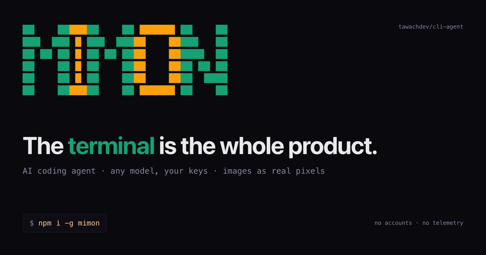

<div align="center">



# mimon

**The terminal is the whole product.** An AI coding agent that lives in your terminal — any model, your keys, images as real pixels. No accounts, no dashboard, no telemetry.

[Live demo](https://mimon-landing.vercel.app) · [Install](#start-in-30-seconds) · [Safety](#safety)


</div>

## Start in 30 seconds

| Path | Command |
|------|---------|
| one shot, nothing installed | `npx mimon-cli "summarize this folder"` |
| self-contained binary | `curl -fsSL https://raw.githubusercontent.com/tawachdev/cli-agent/main/install.sh \| sh` then `agent` |
| package manager | `npm i -g mimon-cli` then `mimon` |

The binary is self-contained (runtime embedded — macOS/Linux, arm64/x64, nothing else to install). First launch opens the setup wizard: pick a provider (anthropic, openai, deepseek, glm, gemini, or any OpenAI-compatible endpoint), paste its API key — the key is tested live and bound to all four model tiers. Nothing else is required.

If `agent` is not found after the curl install, open a new shell so PATH picks it up.

The CLI starts the local engine by itself (loopback-only, port `7800`). From source: `bun install && bun run cli`.

## The shape of a turn

```text
~ ❯ fix the failing test in src/tui
● reading src/tui/chat.ts · 444 lines
⚠ edit src/tui/chat.ts
  - if (chunks.length) return null
  + if (!chunks.length) return null
  allow [a] · edit [e] · deny [n]  → a
✓ patched · 1 hunk
● exec bun test src/tui
✓ 42 pass · 0 fail · 312 ms
```

Writes and execs wait on a visible diff; read-only tools just run. The [live demo](https://mimon-landing.vercel.app) replays a full session in your browser.

## What you get

| Capability | What it means |
|------------|---------------|
| Terminal-native TUI | pixel-font boot screen, boxed prompt, model picker, permission cards; repaints cleanly at any terminal size |
| Any model, your keys | anthropic, openai, deepseek, glm, gemini, or any OpenAI-compatible endpoint; keys live in the macOS Keychain — never logged, never returned |
| Images in the terminal | drop a path, see real pixels on iTerm2/WezTerm/kitty/Ghostty, a clean info panel elsewhere; the model sees it either way |
| Make it yours | rename the agent and repaint it — per letter if you want — from a 256-color grid, presets, or custom hex; saved for every launch |
| Local engine | loopback-only server on `127.0.0.1:7800`; the CLI refuses non-loopback engines |
| Ask-first tools | writes and execs show a diff and wait for your key; every call lands in an append-only audit log |

The `/` menu is the control panel: `/setup` connects a provider, `/providers` manages keys and custom endpoints, `/model` routes tiers, `/brand` changes identity. A quiet hint appears on first launch if no provider is connected — nothing takes over your screen.

## CLI keys

| Key | Action |
|-----|--------|
| `enter` | send · `/` command menu · `tab` cycle model tier |
| `/setup` `/providers` `/model` | wizard · keys & custom providers · tier routing |
| `esc` | stop a turn / close a menu · `ctrl+c` quit |

## Configuration

| Variable | Default | Notes |
|----------|---------|-------|
| `AGENT_PORT` | `7800` | engine, loopback only |
| `AGENT_NAME` / `AGENT_COLORS` | `MIMON` / `teal,gold` | display identity |
| `AGENT_MODEL_TIER1..MAX` | unset | tier routing, `.agent/models.json` wins over env |
| `AGENT_KEY_<PROVIDER>` | — | key per provider (Keychain is the primary store) |
| `AGENT_WORKSPACE_ROOT` | engine cwd | the only directory file tools may touch |

## Make it yours

`/brand` inside the TUI: change the name (2–12 letters), one color for the whole name or one per letter — from 14 presets, the full 256-color grid, or custom hex (`#rrggbb`, truecolor where supported). Your applied colors are remembered as swatches (up to 12 custom, in `.agent/brand.json`) and every launch boots with your brand. Environment works too, and a saved `/brand` choice wins over it:

```sh
AGENT_NAME=ANIR AGENT_COLORS=purple,gold mimon
```

Permanent defaults live in `src/shared/brand.ts` (`DEFAULT_BRAND` / `DEFAULT_COLORS`) — one file owns the identity.

Custom OpenAI-compatible endpoints (Groq, OpenRouter, Together, LM Studio...) are first-class: `/providers` → **+ add provider** → name, base URL, models. They persist in `.agent/providers.json`. Base URLs are validated before the engine dials: real URL parse, public `https://` only (`http` for 127.0.0.1/localhost), private and link-local ranges (10.x, 192.168.x, 172.16–31.x, 169.254.x), embedded credentials, control characters and overlong values are all rejected.

## Images in the terminal

Drag an image into the prompt: the path disappears, the image renders as a preview, and a `▤N` counter appears in the status bar — enter sends it (esc clears attachments). Or just type a path:

```sh
mimon "what does /path/to/screenshot.png show?"
```

| Terminal | What you see |
|----------|--------------|
| iTerm2, WezTerm, mintty | inline pixels (iterm protocol) |
| kitty, Ghostty | inline pixels (kitty protocol, chunked) |
| anything else | clean info panel — the model still gets the image |

PNG decoding is pure TypeScript (chunks → zlib inflate → Paeth unfilter). Caps: 4 images per message, 6 MB each, png/jpeg/gif/webp/bmp, validated by magic bytes end to end. Images need a vision-capable model on the active tier; models without tool support are handled automatically by the engine.

## Safety

- **Writes & execs ask first** — read-only tools auto-run; anything that lands on disk or spawns a process shows a visible diff and waits.
- **Loopback only** — the engine binds `127.0.0.1` and refuses to serve anything else; the CLI refuses non-loopback engines.
- **Append-only audit** — every tool call and permission decision is logged; the log never rewinds.
- **Keys stay home** — macOS Keychain (or `AGENT_KEY_*` env / 0600 file elsewhere), never logged, never audited, never returned by any endpoint.
- **One sandbox** — file tools touch only `AGENT_WORKSPACE_ROOT`.

Technical identifiers (`AGENT_*` env vars, `.agent/` state folder, `agent` Keychain service, port `7800`) are stable on purpose so the product can coexist with any other agent on the same machine.

## Honest limits

- No cloud, no accounts, no telemetry — and no mobile or web client by design; if you want IDE-inline diffs or parallel cloud runs, an editor plugin or cloud agent scores better there.
- Images need a vision-capable model on the active tier.
- Prebuilt binaries cover macOS and Linux only.

## Verify

```sh
bun run typecheck        tsc --noEmit, strict
bun test                 TUI resize storms, pixel font, image pipeline, engine routes
bun run stage            renders every TUI state (works with AGENT_NAME / AGENT_COLORS)
```
